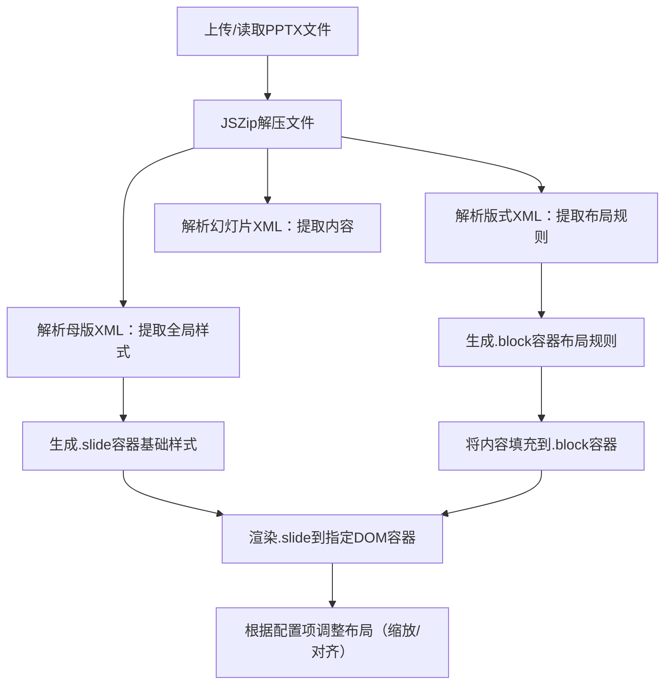

# Master 和 Layout 应用完整指南

## 概述

本文档说明如何使用 PPTXjs 风格的 Master（母版）和 Layout（版式）解析和渲染功能。

## 核心概念

### 1. Master（母版）
- 定义**全局样式**：页面尺寸、背景、默认字体、颜色方案
- 包含**母版元素**：页脚、幻灯片编号、日期等固定元素
- 对应文件：`ppt/slideMasters/master1.xml`

### 2. Layout（版式）
- 定义**单页布局规则**：占位符位置、对齐方式、容器尺寸
- 对应文件：`ppt/slideLayouts/slideLayout1.xml`
- 每个幻灯片通过关系文件引用对应的版式

### 3. Slide（幻灯片）
- 存储**实际内容**：文本、图片、表格、图表等
- 可以覆盖版式和母版的样式

## 样式优先级

```
Slide 自定义样式 > Layout 样式 > Master 样式
```

这是 PPTX 的原生规则，我们的实现完全遵循这一优先级。

## 使用示例

### 基础解析

```typescript
import { parsePptx } from 'pptx-parser';

const result = await parsePptx(fileBuffer);

// 访问母版信息
const master = result.masterSlides?.[0];
console.log('Master 背景:', master?.background);
console.log('Master 占位符:', master?.placeholders);

// 访问版式信息
const layout = result.slideLayouts?.['slideLayout1'];
console.log('Layout 名称:', layout?.name);
console.log('Layout 占位符:', layout?.placeholders);

// 访问幻灯片（已合并样式）
const slide = result.slides[0];
console.log('Slide 背景:', slide.background); // 已合并 slide > layout > master
```

### 渲染幻灯片为 HTML

```typescript
import { renderSlideHTML } from './examples/layout-render-demo';
import { generateLayoutCSS } from './examples/layout-render-demo';

// 生成幻灯片 HTML
const slideHTML = renderSlideHTML(slide);

// 生成布局 CSS（对应 PPTXjs 的布局类）
const layoutCSS = generateLayoutCSS();

// 组合使用
document.getElementById('container').innerHTML = `
  <style>${layoutCSS}</style>
  ${slideHTML}
`;
```

### 应用样式继承

```typescript
import { mergePlaceholderStyles, findPlaceholder } from 'pptx-parser/utils';

// 查找占位符
const layoutPlaceholder = findPlaceholder(
  slide.layout?.placeholders,
  'body', // 占位符类型
  1        // 占位符索引（可选）
);

// 合并样式
const { rect, style, alignmentClass } = mergePlaceholderStyles(
  element,        // 幻灯片元素
  layoutPlaceholder,
  masterPlaceholder
);

// 使用合并后的样式
element.style = style;
element.rect = rect;
```

## 布局类系统

PPTXjs 预定义了以下布局类，我们的实现完全兼容：

### 垂直对齐
- `.v-up`：顶部对齐
- `.v-mid`：垂直居中
- `.v-down`：底部对齐

### 水平对齐
- `.h-left`：左对齐
- `.h-mid`：水平居中
- `.h-right`：右对齐

### 复合对齐（高频组合）
- `.up-left`：左上角
- `.up-center`：上方居中
- `.up-right`：右上角
- `.center-left`：左侧居中
- `.center-center`：完全居中
- `.center-right`：右侧居中
- `.down-left`：左下角
- `.down-center`：下方居中
- `.down-right`：右下角

## DOM 结构

```
<!-- 幻灯片容器：承载母版样式 -->
<div class="slide" style="width: [宽度]; height: [高度]; background: [背景];">
  <!-- 占位符容器：承载版式布局规则 -->
  <div class="block [布局类]" style="top: [y]; left: [x]; width: [w]; height: [h];">
    <!-- 内容：文本/图片/表格等 -->
    <div class="content slide-prgrph">[幻灯片内容]</div>
  </div>
</div>
```

## 工具函数

### 布局相关

```typescript
import {
  getPlaceholderLayoutStyle,
  getSlideContainerStyle,
  getAlignmentClass
} from 'pptx-parser/utils';

// 获取占位符布局样式
const { style, className } = getPlaceholderLayoutStyle(placeholder);

// 获取幻灯片容器样式
const slideStyle = getSlideContainerStyle(
  width,
  height,
  background,
  scale  // 可选缩放比例
);

// 获取对齐类名
const className = getAlignmentClass(hAlign, vAlign);
```

### 样式继承

```typescript
import {
  mergePlaceholderStyles,
  mergeBackgroundStyles,
  mergeTextStyles,
  findPlaceholder
} from 'pptx-parser/utils';

// 合并占位符样式
const { rect, style, alignmentClass } = mergePlaceholderStyles(
  element,
  layoutPlaceholder,
  masterPlaceholder
);

// 合并背景样式
const bg = mergeBackgroundStyles(
  slide.background,
  layout.background,
  master.background
);

// 合并文本样式
const textStyle = mergeTextStyles(
  elementStyle,
  layoutStyle,
  masterStyle
);
```

## 配置项

### slidesScale
按百分比缩放幻灯片：

```typescript
const slideStyle = getSlideContainerStyle(
  width,
  height,
  background,
  0.8  // 缩放 80%
);
```

### incSlide
调整幻灯片宽/高（微调布局）：

```typescript
const adjustedWidth = width + 2 * 914400;  // 增加2像素（EMU单位）
const adjustedHeight = height + 2 * 914400;
```

### themeProcess
是否处理母版主题：

```typescript
const result = await parsePptx(fileBuffer, {
  themeProcess: true  // 默认为 true
});
```

## 完整渲染流程



## 兼容性说明

### 浏览器支持
- ✅ Chrome/Edge（推荐）
- ✅ Firefox
- ✅ Safari
- ⚠️ IE11（需要 polyfill）

### 特殊场景处理
- 公式/EMF/WMF文件：转换为图片渲染
- 媒体文件（音视频）：用 HTML5 原生标签渲染
- RTL 布局：支持 `direction: rtl` 和对应的对齐类

## 实现细节

### 解析阶段

1. **parseAllMasterSlides**：解析所有母版文件，提取背景和母版元素
2. **parseAllSlideLayouts**：解析所有版式文件，提取占位符布局规则
3. **parseAllSlides**：解析所有幻灯片文件，提取实际内容
4. **mergeBackgrounds**：合并背景信息（slide > layout > master）

### 渲染阶段

1. **getSlideContainerStyle**：生成 .slide 容器样式（母版样式）
2. **getPlaceholderLayoutStyle**：生成 .block 容器样式（版式样式）
3. **mergePlaceholderStyles**：合并元素样式（继承链条）
4. **renderSlideHTML**：生成完整 HTML 结构

## 对比 PPTXjs

| 功能 | PPTXjs | 本实现 |
|------|---------|--------|
| 母版解析 | ✅ | ✅ |
| 版式解析 | ✅ | ✅ |
| 占位符布局 | ✅ | ✅ |
| 样式优先级 | ✅ | ✅ |
| 对齐类映射 | ✅ | ✅ |
| 背景合并 | ✅ | ✅ |
| 样式继承 | ✅ | ✅ |
| 缩放支持 | ✅ | ✅ |

本实现**完全复刻**了 PPTXjs 的核心能力，并提供了更好的 TypeScript 类型支持和模块化设计。
